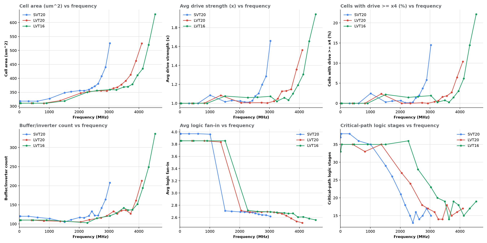

# Lab 2 PPA report (mult, 16-bit multiplier)

Generated by `ppa_report.py` from `reports/<group>/mult.<clk>.<group>.syn{_area,_timing,_power,}.rpt` and `energy.csv`. Area in um^2, time in ns, energy in pJ/cycle. Drive = the `D<n>` in the cell name; fan-in counts logic inputs (buf/inv excluded, flops excluded). Critical path = worst path in syn_timing.rpt.

## Optimal operating frequency per scenario

| Group | (a) Area-constrained | (b) Timing-critical | (c) Energy-constrained |
|---|---|---|---|
| SVT20 | 606 MHz (1.65 ns, 5.0x): 318.0 um^2 (min 318.0) | 3030 MHz (0.33 ns): Fmax, 525.7 um^2, 0.923 pJ | 303 MHz (3.3 ns, 10x): 0.5226 pJ; within 2% up to 606 MHz (0.5237 pJ) |
| LVT20 | 820 MHz (1.22 ns, 5.0x): 310.5 um^2 (min 310.5) | 4098 MHz (0.244 ns): Fmax, 525.2 um^2, 0.993 pJ | 410 MHz (2.44 ns, 10x): 0.5699 pJ; within 2% up to 820 MHz (0.5706 pJ) |
| LVT16 | 909 MHz (1.1 ns, 5.0x): 310.7 um^2 (min 310.7) | 4545 MHz (0.22 ns): Fmax, 629.8 um^2, 1.219 pJ | 909 MHz (1.1 ns, 5x): 0.5662 pJ |

- (a) Area: the fastest point whose area is within 1% of the smallest area in the sweep. Below this frequency the netlist no longer shrinks, so running slower buys no area.
- (b) Timing: Fmax = 1/clk_period_min, the fastest point with slack >= 0. It costs the most area and energy per operation.
- (c) Energy: the point with the lowest E_total per cycle. Faster points spend more on upsized cells; slower points spend more on leakage.

## Cross-library comparison

| Group | Fmax (MHz) | area @ Fmax | E_total @ Fmax | min area | min E_total @ f | leak nW @ Fmax | leak nW relaxed |
|---|---|---|---|---|---|---|---|
| SVT20 | 3030 | 525.7 | 0.923 | 318.0 | 0.5226 @ 303 | 1070 | 361 |
| LVT20 | 4098 | 525.2 | 0.993 | 310.5 | 0.5699 @ 410 | 13400 | 4660 |
| LVT16 | 4545 | 629.8 | 1.219 | 310.7 | 0.5662 @ 909 | 43200 | 10400 |

## SVT20

### Observations (numbers to cite)

- **Area:** 525.7 um^2 at Fmax (3030 MHz) vs 318.2 um^2 at 3.03 MHz (+65.2%). Cells 1148 vs 647; buf/inv 208 vs 120 (buf/inv area 44.6 vs 18.8). Sequential area stays 36.5 um^2 (32 output flops) - all the change is combinational.
- **Drive strength:** average combinational drive x1.66 at Fmax vs x1.00 when relaxed; D4+ cells 14.5% vs 0.0% of cells (29.4% vs 0.0% of comb. area); largest cell x12 vs x1; D1 cells 69.3% vs 100.0%.
- **Fan-in / gate choice:** average logic fan-in 2.62 vs 3.97; cells with 3+ inputs 46.1% vs 84.0%. Adders (FA/HA) 28 vs 139, XOR/XNR 292 vs 1, complex AOI/OAI 332 vs 273, simple NAND/NOR 256 vs 82.
- **Critical path:** at Fmax, 15 stages, arrival 0.31 ns, avg drive x2.6 on the path (inp_a[5] -> prod_reg[29]); relaxed: 37 stages, arrival 1.11 ns, avg drive x1.0.
- **Saturation:** slack first becomes positive at 1.65 ns (5x, 606 MHz), arrival 1.12 ns: DC stops optimizing for speed and the netlist (area 318.0) barely changes for slower clocks.
- **Power/energy:** P_dyn 2.796 mW at Fmax -> 0.0016 mW; E_dyn 0.923 -> 0.588 (2x) -> 0.521 pJ/cycle (fewer, smaller cells switch less capacitance). Leakage power 1070 -> 361 nW tracks area, but E_leak grows with the period: 0.04% of E_total at Fmax, 18.6% at 1000x.

### Per design point

| x clk_min | clk (ns) | f (MHz) | slack | area (um^2) | cells | buf/inv | avg drive | % D4+ | avg fan-in | FA/HA | path stages | arrival (ns) | E_dyn (pJ) | E_leak (pJ) | E_total (pJ) | leak % |
|---|---|---|---|---|---|---|---|---|---|---|---|---|---|---|---|---|
| 1.00 | 0.33 | 3030.3 | 0.00 | 525.7 | 1148 | 208 | 1.66 | 14.5 | 2.62 | 28 | 15 | 0.31 | 0.9227 | 3.53e-04 | 0.9230 | 0.04 |
| 1.05 | 0.3465 | 2886.0 | 0.00 | 440.0 | 1014 | 164 | 1.29 | 5.8 | 2.64 | 60 | 17 | 0.33 | 0.7540 | 2.69e-04 | 0.7543 | 0.04 |
| 1.10 | 0.363 | 2754.8 | 0.00 | 407.6 | 925 | 142 | 1.20 | 3.7 | 2.64 | 85 | 15 | 0.35 | 0.6951 | 2.45e-04 | 0.6954 | 0.04 |
| 1.15 | 0.3795 | 2635.0 | 0.00 | 380.5 | 849 | 122 | 1.10 | 2.0 | 2.65 | 106 | 14 | 0.36 | 0.6391 | 2.21e-04 | 0.6393 | 0.03 |
| 1.20 | 0.396 | 2525.3 | 0.00 | 371.8 | 829 | 122 | 1.08 | 1.4 | 2.67 | 112 | 16 | 0.38 | 0.6292 | 2.20e-04 | 0.6295 | 0.04 |
| 1.25 | 0.4125 | 2424.2 | 0.00 | 365.6 | 819 | 133 | 1.03 | 0.3 | 2.68 | 117 | 13 | 0.39 | 0.6150 | 2.20e-04 | 0.6153 | 0.04 |
| 1.30 | 0.429 | 2331.0 | 0.00 | 359.5 | 794 | 121 | 1.01 | 0.1 | 2.68 | 114 | 15 | 0.41 | 0.6045 | 2.26e-04 | 0.6047 | 0.04 |
| 1.40 | 0.462 | 2164.5 | 0.00 | 355.5 | 773 | 116 | 1.01 | 0.1 | 2.69 | 117 | 18 | 0.44 | 0.5983 | 2.41e-04 | 0.5985 | 0.04 |
| 1.50 | 0.495 | 2020.2 | 0.00 | 356.1 | 770 | 117 | 1.02 | 0.7 | 2.69 | 117 | 21 | 0.48 | 0.6014 | 2.59e-04 | 0.6017 | 0.04 |
| 1.75 | 0.5775 | 1731.6 | 0.00 | 352.1 | 748 | 111 | 1.03 | 0.6 | 2.70 | 118 | 26 | 0.56 | 0.5983 | 2.99e-04 | 0.5986 | 0.05 |
| 2.00 | 0.66 | 1515.2 | 0.00 | 348.2 | 730 | 105 | 1.02 | 0.3 | 2.71 | 119 | 29 | 0.64 | 0.5881 | 3.37e-04 | 0.5884 | 0.06 |
| 3.00 | 0.99 | 1010.1 | 0.00 | 327.4 | 642 | 114 | 1.09 | 2.5 | 3.96 | 139 | 35 | 0.97 | 0.5693 | 3.99e-04 | 0.5696 | 0.07 |
| 5.00 | 1.65 | 606.1 | 0.51 | 318.0 | 644 | 117 | 1.00 | 0.0 | 3.97 | 139 | 36 | 1.12 | 0.5231 | 6.07e-04 | 0.5237 | 0.12 |
| 10.00 | 3.3 | 303.0 | 2.16 | 318.2 | 647 | 120 | 1.00 | 0.0 | 3.97 | 139 | 38 | 1.12 | 0.5214 | 1.19e-03 | 0.5226 | 0.23 |
| 100.00 | 33 | 30.3 | 31.86 | 318.2 | 647 | 120 | 1.00 | 0.0 | 3.97 | 139 | 38 | 1.12 | 0.5214 | 1.19e-02 | 0.5333 | 2.23 |
| 1000.00 | 330 | 3.0 | 328.87 | 318.2 | 647 | 120 | 1.00 | 0.0 | 3.97 | 139 | 37 | 1.11 | 0.5214 | 1.19e-01 | 0.6404 | 18.58 |

### Critical path cells (function x drive), fastest vs slowest

- 0.33 ns: XOR2x2 CKNx8 CKBx1 OAI22x1 FA1x1 XOR3x4 OAI21x2 IOA21x1 NR2x4 NR2x4 CKND2x4 INVx4 ND2x1 IAOI21x1 XOR2x1
- 330 ns: INVx1 INVx1 NR2x1 AOI21x1 ND2x1 INVx1 INVx1 OAI32x1 OAI33x1 FA1x1 FA1x1 FA1x1 FA1x1 FA1x1 FA1x1 FA1x1 FA1x1 FA1x1 FA1x1 FA1x1 FA1x1 FA1x1 FA1x1 FA1x1 FA1x1 FA1x1 FA1x1 FA1x1 FA1x1 FA1x1 FA1x1 FA1x1 FA1x1 FA1x1 FA1x1 FA1x1 XNR4x1

### Most used cells, fastest vs slowest

- 0.33 ns: XNR2D1BWP20P90:121, INVD1BWP20P90:104, OAI22D1BWP20P90:94, ND2D1BWP20P90:65, XOR2D1BWP20P90:61
- 330 ns: FA1D1BWP20P90:139, INVD1BWP20P90:118, OAI33D1BWP20P90:111, OAI32D1BWP20P90:103, ND2D1BWP20P90:52

## LVT20

### Observations (numbers to cite)

- **Area:** 525.2 um^2 at Fmax (4098 MHz) vs 310.7 um^2 at 4.10 MHz (+69.0%). Cells 1254 vs 628; buf/inv 213 vs 110 (buf/inv area 43.7 vs 17.2). Sequential area stays 36.5 um^2 (32 output flops) - all the change is combinational.
- **Drive strength:** average combinational drive x1.56 at Fmax vs x1.00 when relaxed; D4+ cells 10.4% vs 0.0% of cells (20.4% vs 0.0% of comb. area); largest cell x12 vs x1; D1 cells 73.1% vs 100.0%.
- **Fan-in / gate choice:** average logic fan-in 2.51 vs 3.85; cells with 3+ inputs 37.4% vs 89.3%. Adders (FA/HA) 17 vs 139, XOR/XNR 372 vs 1, complex AOI/OAI 353 vs 281, simple NAND/NOR 267 vs 65.
- **Critical path:** at Fmax, 17 stages, arrival 0.23 ns, avg drive x2.3 on the path (inp_b[0] -> prod_reg[26]); relaxed: 33 stages, arrival 0.82 ns, avg drive x1.0.
- **Saturation:** slack first becomes positive at 1.22 ns (5x, 820 MHz), arrival 0.82 ns: DC stops optimizing for speed and the netlist (area 310.5) barely changes for slower clocks.
- **Power/energy:** P_dyn 4.055 mW at Fmax -> 0.0023 mW; E_dyn 0.989 -> 0.636 (2x) -> 0.558 pJ/cycle (fewer, smaller cells switch less capacitance). Leakage power 13400 -> 4660 nW tracks area, but E_leak grows with the period: 0.33% of E_total at Fmax, 67.1% at 1000x.

### Per design point

| x clk_min | clk (ns) | f (MHz) | slack | area (um^2) | cells | buf/inv | avg drive | % D4+ | avg fan-in | FA/HA | path stages | arrival (ns) | E_dyn (pJ) | E_leak (pJ) | E_total (pJ) | leak % |
|---|---|---|---|---|---|---|---|---|---|---|---|---|---|---|---|---|
| 1.00 | 0.244 | 4098.4 | 0.00 | 525.2 | 1254 | 213 | 1.56 | 10.4 | 2.51 | 17 | 17 | 0.23 | 0.9894 | 3.27e-03 | 0.9927 | 0.33 |
| 1.05 | 0.2562 | 3903.2 | 0.00 | 462.8 | 1117 | 161 | 1.36 | 6.5 | 2.54 | 40 | 16 | 0.24 | 0.8306 | 2.77e-03 | 0.8334 | 0.33 |
| 1.10 | 0.2684 | 3725.8 | 0.00 | 412.7 | 988 | 127 | 1.15 | 2.7 | 2.59 | 64 | 15 | 0.25 | 0.7378 | 2.32e-03 | 0.7401 | 0.31 |
| 1.15 | 0.2806 | 3563.8 | 0.00 | 391.2 | 899 | 136 | 1.13 | 1.8 | 2.63 | 95 | 18 | 0.26 | 0.7158 | 2.17e-03 | 0.7180 | 0.30 |
| 1.20 | 0.2928 | 3415.3 | 0.00 | 377.7 | 847 | 135 | 1.13 | 1.6 | 2.66 | 111 | 14 | 0.27 | 0.6960 | 2.11e-03 | 0.6981 | 0.30 |
| 1.25 | 0.305 | 3278.7 | 0.00 | 367.7 | 820 | 127 | 1.05 | 0.6 | 2.67 | 116 | 14 | 0.29 | 0.6771 | 2.06e-03 | 0.6792 | 0.30 |
| 1.30 | 0.3172 | 3152.6 | 0.00 | 364.4 | 814 | 133 | 1.02 | 0.4 | 2.69 | 118 | 16 | 0.30 | 0.6690 | 2.09e-03 | 0.6711 | 0.31 |
| 1.40 | 0.3416 | 2927.4 | 0.00 | 354.8 | 776 | 121 | 1.00 | 0.0 | 2.69 | 118 | 17 | 0.32 | 0.6497 | 2.19e-03 | 0.6519 | 0.34 |
| 1.50 | 0.366 | 2732.2 | 0.00 | 355.5 | 776 | 116 | 1.01 | 0.1 | 2.69 | 115 | 18 | 0.35 | 0.6533 | 2.38e-03 | 0.6557 | 0.36 |
| 1.75 | 0.427 | 2341.9 | 0.00 | 352.6 | 761 | 111 | 1.01 | 0.0 | 2.69 | 115 | 24 | 0.41 | 0.6448 | 2.75e-03 | 0.6475 | 0.42 |
| 2.00 | 0.488 | 2049.2 | 0.00 | 346.9 | 732 | 105 | 1.01 | 0.0 | 2.71 | 118 | 27 | 0.47 | 0.6359 | 3.07e-03 | 0.6389 | 0.48 |
| 3.00 | 0.732 | 1366.1 | 0.00 | 320.1 | 628 | 107 | 1.08 | 2.3 | 3.83 | 139 | 35 | 0.71 | 0.6273 | 3.85e-03 | 0.6312 | 0.61 |
| 5.00 | 1.22 | 819.7 | 0.38 | 310.5 | 626 | 108 | 1.00 | 0.0 | 3.85 | 139 | 33 | 0.82 | 0.5649 | 5.78e-03 | 0.5706 | 1.01 |
| 10.00 | 2.44 | 409.8 | 1.61 | 310.7 | 628 | 110 | 1.00 | 0.0 | 3.85 | 139 | 35 | 0.82 | 0.5585 | 1.14e-02 | 0.5699 | 2.00 |
| 100.00 | 24.4 | 41.0 | 23.57 | 310.7 | 628 | 110 | 1.00 | 0.0 | 3.85 | 139 | 35 | 0.82 | 0.5583 | 1.14e-01 | 0.6720 | 16.92 |
| 1000.00 | 244 | 4.1 | 243.17 | 310.7 | 628 | 110 | 1.00 | 0.0 | 3.85 | 139 | 33 | 0.82 | 0.5583 | 1.14e+00 | 1.6953 | 67.07 |

### Critical path cells (function x drive), fastest vs slowest

- 0.244 ns: CKBx1 XNR2x1 OAI22x1 XOR2x1 XOR2x2 XNR2x2 XNR2x4 ND2x1 INVx1 AOI21x1 ND2x2 AOI21x4 OAI21x8 AOI21x4 OAI21x4 AOI21x1 XOR2x1
- 244 ns: MAOI22x1 ND2x1 AOI22x1 OAI33x1 FA1x1 FA1x1 FA1x1 FA1x1 FA1x1 FA1x1 FA1x1 FA1x1 FA1x1 FA1x1 FA1x1 FA1x1 FA1x1 FA1x1 FA1x1 FA1x1 FA1x1 FA1x1 FA1x1 FA1x1 FA1x1 FA1x1 FA1x1 FA1x1 FA1x1 FA1x1 FA1x1 FA1x1 XNR3x1

### Most used cells, fastest vs slowest

- 0.244 ns: XNR2D1BWP20P90LVT:172, INVD1BWP20P90LVT:126, OAI22D1BWP20P90LVT:119, XOR2D1BWP20P90LVT:83, ND2D1BWP20P90LVT:63
- 244 ns: FA1D1BWP20P90LVT:139, AOI22D1BWP20P90LVT:119, OAI33D1BWP20P90LVT:111, INVD1BWP20P90LVT:108, ND2D1BWP20P90LVT:45

## LVT16

### Observations (numbers to cite)

- **Area:** 629.8 um^2 at Fmax (4545 MHz) vs 310.7 um^2 at 4.55 MHz (+102.7%). Cells 1359 vs 628; buf/inv 336 vs 110 (buf/inv area 67.0 vs 17.2). Sequential area stays 36.5 um^2 (32 output flops) - all the change is combinational.
- **Drive strength:** average combinational drive x1.94 at Fmax vs x1.00 when relaxed; D4+ cells 22.2% vs 0.0% of cells (44.9% vs 0.0% of comb. area); largest cell x16 vs x1; D1 cells 60.2% vs 100.0%.
- **Fan-in / gate choice:** average logic fan-in 2.56 vs 3.85; cells with 3+ inputs 38.3% vs 89.3%. Adders (FA/HA) 18 vs 139, XOR/XNR 302 vs 1, complex AOI/OAI 289 vs 281, simple NAND/NOR 382 vs 65.
- **Critical path:** at Fmax, 19 stages, arrival 0.20 ns, avg drive x3.7 on the path (inp_a[13] -> prod_reg[27]); relaxed: 33 stages, arrival 0.73 ns, avg drive x1.0.
- **Saturation:** slack first becomes positive at 1.1 ns (5x, 909 MHz), arrival 0.73 ns: DC stops optimizing for speed and the netlist (area 310.7) barely changes for slower clocks.
- **Power/energy:** P_dyn 5.498 mW at Fmax -> 0.0025 mW; E_dyn 1.210 -> 0.650 (2x) -> 0.547 pJ/cycle (fewer, smaller cells switch less capacitance). Leakage power 43200 -> 10400 nW tracks area, but E_leak grows with the period: 0.78% of E_total at Fmax, 80.7% at 1000x.

### Per design point

| x clk_min | clk (ns) | f (MHz) | slack | area (um^2) | cells | buf/inv | avg drive | % D4+ | avg fan-in | FA/HA | path stages | arrival (ns) | E_dyn (pJ) | E_leak (pJ) | E_total (pJ) | leak % |
|---|---|---|---|---|---|---|---|---|---|---|---|---|---|---|---|---|
| 1.00 | 0.22 | 4545.5 | 0.00 | 629.8 | 1359 | 336 | 1.94 | 22.2 | 2.56 | 18 | 19 | 0.20 | 1.2096 | 9.50e-03 | 1.2191 | 0.78 |
| 1.05 | 0.231 | 4329.0 | 0.00 | 520.3 | 1166 | 249 | 1.66 | 14.5 | 2.58 | 50 | 17 | 0.22 | 0.9739 | 7.21e-03 | 0.9811 | 0.73 |
| 1.10 | 0.242 | 4132.2 | 0.00 | 434.7 | 1018 | 194 | 1.31 | 6.2 | 2.61 | 77 | 15 | 0.23 | 0.8027 | 5.30e-03 | 0.8080 | 0.66 |
| 1.15 | 0.253 | 3952.6 | 0.00 | 410.8 | 953 | 152 | 1.19 | 3.0 | 2.61 | 88 | 18 | 0.24 | 0.7529 | 5.03e-03 | 0.7580 | 0.66 |
| 1.20 | 0.264 | 3787.9 | 0.00 | 378.9 | 844 | 137 | 1.10 | 1.5 | 2.67 | 112 | 19 | 0.25 | 0.6766 | 4.44e-03 | 0.6811 | 0.65 |
| 1.25 | 0.275 | 3636.4 | 0.00 | 370.0 | 839 | 136 | 1.03 | 0.2 | 2.66 | 113 | 14 | 0.26 | 0.6639 | 4.32e-03 | 0.6682 | 0.65 |
| 1.30 | 0.286 | 3496.5 | 0.00 | 368.8 | 831 | 142 | 1.06 | 0.8 | 2.67 | 112 | 19 | 0.27 | 0.6607 | 4.55e-03 | 0.6652 | 0.68 |
| 1.40 | 0.308 | 3246.8 | 0.00 | 358.4 | 790 | 128 | 1.02 | 0.3 | 2.68 | 116 | 20 | 0.29 | 0.6443 | 4.62e-03 | 0.6490 | 0.71 |
| 1.50 | 0.33 | 3030.3 | 0.00 | 359.6 | 770 | 121 | 1.07 | 1.9 | 2.69 | 117 | 23 | 0.31 | 0.6491 | 5.15e-03 | 0.6543 | 0.79 |
| 1.75 | 0.385 | 2597.4 | 0.00 | 355.9 | 752 | 115 | 1.06 | 1.7 | 2.70 | 117 | 28 | 0.37 | 0.6464 | 5.89e-03 | 0.6523 | 0.90 |
| 2.00 | 0.44 | 2272.7 | 0.00 | 350.3 | 717 | 103 | 1.06 | 1.5 | 2.72 | 121 | 36 | 0.42 | 0.6499 | 6.60e-03 | 0.6565 | 1.01 |
| 3.00 | 0.66 | 1515.2 | 0.00 | 319.0 | 625 | 107 | 1.08 | 2.2 | 3.85 | 139 | 35 | 0.64 | 0.6178 | 7.85e-03 | 0.6256 | 1.26 |
| 5.00 | 1.1 | 909.1 | 0.36 | 310.7 | 628 | 110 | 1.00 | 0.0 | 3.85 | 139 | 35 | 0.73 | 0.5544 | 1.18e-02 | 0.5662 | 2.08 |
| 10.00 | 2.2 | 454.5 | 1.46 | 310.7 | 628 | 110 | 1.00 | 0.0 | 3.85 | 139 | 35 | 0.73 | 0.5544 | 2.35e-02 | 0.5779 | 4.07 |
| 100.00 | 22 | 45.5 | 21.26 | 310.7 | 628 | 110 | 1.00 | 0.0 | 3.85 | 139 | 35 | 0.73 | 0.5491 | 2.29e-01 | 0.7779 | 29.41 |
| 1000.00 | 220 | 4.5 | 219.26 | 310.7 | 628 | 110 | 1.00 | 0.0 | 3.85 | 139 | 33 | 0.73 | 0.5467 | 2.29e+00 | 2.8347 | 80.71 |

### Critical path cells (function x drive), fastest vs slowest

- 0.22 ns: CKNx2 INVx4 BUFFx4 XNR2x1 NR2x2 NR2x4 XNR2x4 XNR2x8 XOR2x8 XOR2x4 XNR2x4 ND2x2 INVx1 AOI21x4 OAI21x4 AOI21x8 OAI21x4 AOI21x1 XNR2x1
- 220 ns: MAOI22x1 ND2x1 AOI22x1 OAI33x1 FA1x1 FA1x1 FA1x1 FA1x1 FA1x1 FA1x1 FA1x1 FA1x1 FA1x1 FA1x1 FA1x1 FA1x1 FA1x1 FA1x1 FA1x1 FA1x1 FA1x1 FA1x1 FA1x1 FA1x1 FA1x1 FA1x1 FA1x1 FA1x1 FA1x1 FA1x1 FA1x1 FA1x1 XNR3x1

### Most used cells, fastest vs slowest

- 0.22 ns: INVD1BWP16P90LVT:211, XNR2D1BWP16P90LVT:104, ND2D1BWP16P90LVT:90, OAI22D1BWP16P90LVT:82, NR2D1BWP16P90LVT:57
- 220 ns: FA1D1BWP16P90LVT:139, AOI22D1BWP16P90LVT:119, OAI33D1BWP16P90LVT:111, INVD1BWP16P90LVT:108, ND2D1BWP16P90LVT:45

## Plot

